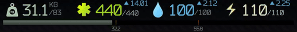
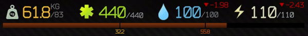

## About Mod

Mod that shows a progress bar representing your characters encumberance in the inventory. Labeled tickmarks (text can be turned off) for breakpoints of overweight and walking drains stamina.

#### Always know your carry weight and how close you are to breakpoints

#### Updates dynamically with stims and level ups

## Installation

[Releases are here](https://github.com/mpstark/SPT-PlayerEncumbranceBar/releases). Open zip file and drag `BepInEx` folder into root of your SPT-AKI install.

## Configuration

- **Display Breakpoint Text**: If text for each tick mark breakpoint should be displayed

## License

Distributed under the MIT license. See [`LICENSE.txt`](LICENSE.txt) for more details.

## Acknowledgments

- [CJ](https://github.com/CJ-SPT) for letting me hack on [StashSearch](https://github.com/CJ-SPT/StashSearch) as my first SPT-AKI modding experience
- [DrakiaXYZ](https://github.com/DrakiaXYZ) for having multiple great mods to look at for examples
- [Arys](https://github.com/Nympfonic) for being awesome
- People in the SPT discord that gave opinions on various things
